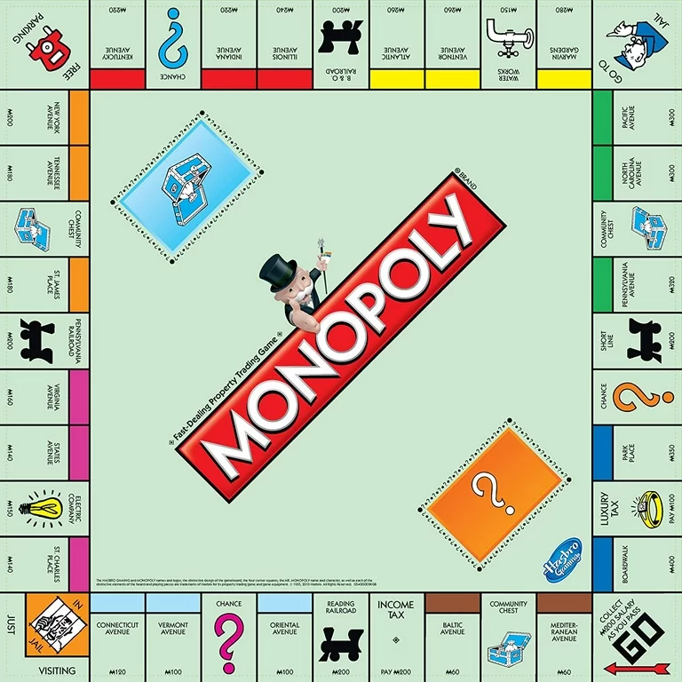

# Monopoly Engine

A multipurpose monopoly engine for gameplay, strategy, machine learning, and statistical analysis.

# Overview

> Disclaimer: This is an independent personal project. I do not own the rights to monopoly and am not affiliated with Hasbro.

This project will include a playable monopoly game using the MVC design paradigm, a trading system for transactions between players, CLI for user input, and an AI system to optimize decision making. There will also be a module for game theory, statistics, and heuristics for different economic factors in the game. The ruleset is based off of the [Monopoly Wiki](https://monopoly.fandom.com/wiki/House_Rules), personal interpretation, as well as popular consensus on how to game is usually played. This project also contains extensive unit testing and will likely be subject to improvement in the near future. This project is entirely coded in python due to its ease when it comes to programming game logic as well as its vast support for machine learning. There may also be an AI chatbot for the purpose of asking about the rules.

# Rules

As previous stated, the rules are based on the standard monopoly rules with a few specifications:

### Central Banking

* There is no auction system because nobody plays that way despite it being in the rules.
* If you are standing on an unowned property, you can buy it no matter whose turn it is as long as it is still unowned and you are still on it.
* All money from deed card charges, taxes, and bailouts goes to the free parking space to be collected by whoever lands on it.
* If you land on go during the game, you get the $200 then as opposed to after when you go past it.

### Jail

* Rolling doubles 3 times in a row will send you to jail automatically and you won't get the landing effect indicated by the 3rd roll.
* If you roll doubles and land on "Go to Jail", your turn ends just like if you didn't roll doubles.
* When in jail, you have 3 turns to try and roll double to get yourself out. If you fail to roll doubles in the 3 turns, you are forced to pay the $50 to bail yourself out.
* Failing to roll doubles on the third turn will automatically move you forward by the dice amount while charging you $50.
* If you go into debt when you bail yourself out of jail and you land on something that gives you the money you need, you are in luck. 
* When in jail, you may still bail yourself out at any time at the beginning or end of a turn.
* If you end up rolling doubles while in jail, you move forward the amount shown by the sum of the dice and your turn ends.

### Debt

* You can't end your turn while in debt.
* Certain deed cards can put you in debt to multiple people at once.
* When paying multiple people at once do to the aforementioned deed cards you pay them all together so they share equally.
* You declare bankruptcy when you have no un-mortgaged properties and don't have enough money to pay your debt.
* After declaring bankruptcy, your remaining balance is given to whoever you're in debt to and if you're in debt to multiple people it is split evenly.

### Properties, Monopolies, Housing, and Hotels

* You must maintains a 1 building difference between properties in a monopoly.
* You can mortgage properties in your monopoly and still keep the benefits of the monopoly as long as all the properties in that monopoly are owned by you.
* When you un-mortgage a property, you must pay the mortgage price plus 10% interest.
* When selling houses and hotels back to the bank, you only get back half of what you paid for them.
* You can't move houses between properties freely. You would have to sell the house and then buy it back for the other property.
* The bank has a limited amount of houses and hotels which can end up restricting building purchases.
* The 1 building rule can be violated in one instance. When you sell a hotel to the bank and don't get enough houses back you'll just get the money.
* If the above situation creates a housing differential greater than one, any proceeding building purchase/sale must restore the 1 building difference.

### Trade

* Players can trade money and assets at any time in the game.
* This includes get out of jail free cards.
* You can keep buildings intact if and only if you trade the whole monopoly.
* You can't make deals that exempt players from paying rent, give players partial ownership, or anything of the sort. You can only trade money and assets.
* You may forgive debts through trade.

